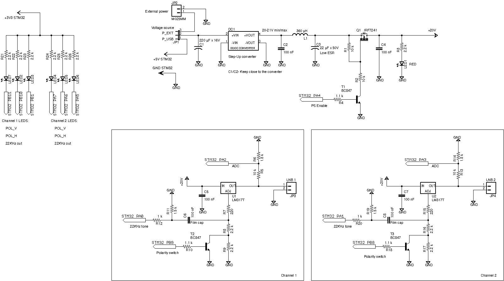

# Satellite LNB controller

This is a repository for a dual-channel satellite LNB controller.

### Components
- Controller board
- Controller firmware
- Desktop GUI application for Linux and macOS
- Desktop Console application for Linux and macOS

---
### Hardware

The controller is based on a popular STM32F103 MCU board, aka "Blue Pill". In my case, it's a black "STM32 MINI" from RobotDyn. I found this version of the "pill" is of better quality and more reliable.<br>
The rest of the LNB controller is built on a breadboard with SMD and through-hole components. Voltage regulators are based on LM317.<br>
The board schematic is down below.
All signals just connected to the appropriate MCU board pins.<br>

As a Step-up converter, I'm using the MT3608 board.<br>
This converter can be replaced with anything that can provide up to 20V and stable >=400 mA. A low noise converter is better.<br>
Sure, this converter can be removed and use just a good enough external power supply.<br>
There are two power options for the converter:
 - USB from the MCU board. But you need a really good USB connector, cable, and host that can provide enough current.
 - External PSU.
 
 
 
 
 ### Controller firmware
 STM32 controller firmware source code can be found here: [mcu_firmware/](<mcu_firmware/>)
 
 To compile this project you will need **gcc-arm-none-eabi package**
 
 Firmware compilation:
 ```bash
 cd mcu_firmware
 make
 ```
 
 Also, there are already compiled binaries in [mcu_firmware/precompiled/](<mcu_firmware/precompiled/>)
 
 The build procedure implies using the ST-Link programmer connected to the SWD port of the MCU board.
Set the following configuration of the BOOT pins:<br>
| Boot pin      | Position |
| --------- | -----:|
| B0  | 1 |
| B1  | 0 |

Connect the controller to ST-Link and the programmer to the PC. Connect the controller to the PC USB port and run the following command:
 ```bash
 make upload
 ```
 
 The controller is programmed and you ready to go.
Disconnect everything and set the boot pins to the default position:
| Boot pin      | Position |
| --------- | -----:|
| B0  | 0 |
| B1  | 0 |

You can power-up the controller now, new firmware should start and perform a "Hello" blink pattern on the board LEDs.

### Desktop application
There are GUI and console applications. Both programs can be run on Linux and macOS systems.<br>
GUI is written with the GTK-3 framework.<br>
You will need "gtk-3.0" library and development files in order to build and run the GUI appication.<br>

On the Linux system just install "libgtk-3-dev" package and you ready to build the program.<br>
On the Apple system (x86) you can install gtk+3 libraries with [homebrew](https://brew.sh/).

 ```bash
brew install epoxy
brew install gtk+3
 ```
 Library installation may take some time.<br>
It's important to export PKG_CONFIG environment variable with a path to the installed library and header files.

```bash
export PKG_CONFIG_PATH=/usr/local/Cellar/libepoxy/1.5.4_1/lib/pkgconfig/:/usr/local/Cellar/gtk+3/3.24.24/lib/pkgconfig/
```
Probably you will need to change packages versions to your current version. Please verify the paths.

Now everything is ready to build the desktop software.
You can type `make` to build both programs (GUI and console).
Alternatively, you can type `make gui` or `make cli` to build only one of the programs.

There is also a few additional make targets are available:
```bash
make install
make uninstall
make install-gui
make uninstall-gui
make install-cli
make uninstall-gui
```

Linux version of the application supports full desktop integration


### GUI application
The program is quite straightforward.
You can select your serial device (typically it's a `/dev/ttyACMX` on Linux and `/dev/tty.cu.usb*` on the Apple system).
The list of the available devices is built automatically during the program start-up.
Then you can switch On and Off the system power supply and configure both LNB channels (polarization and 22KHz tone signal). The program is constantly measured output voltages of the channels.<br>
The Refresh interval is 500 ms.<br>
Additionally, this program reads the whole state of the hardware in order to be in sync GUI-hardware state.

Linux:

<br>
macOS:


### Console application
You can do everything the same with the console application. Just specify the serial device.<br>
For example, read the current hardware state:

```bash
lnb_controller-cli -p /dev/ttyACM0 -g
```

Enable the power supply:
```bash
lnb_controller-cli -p /dev/ttyACM0 -w 1
```
Disable the power supply:
```bash
lnb_controller-cli -p /dev/ttyACM0 -w 1
```


### TODO
Implementing the full DISEqC protocol in order to control positioners. This is the reason why there is an diseq.c file in the MCU firmware directory.
